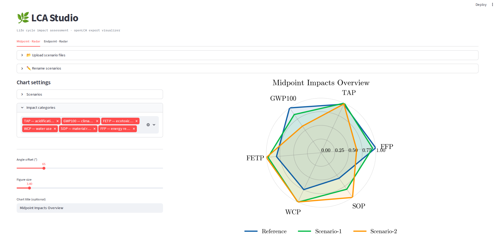

# openLCA Export Visualizer




An interactive visualization tool for comparing openLCA midpoint and endpoint impact results across multiple scenarios. Takes standard openLCA Excel exports and generates high quality radar charts for comparative Life Cycle Assessments.

---

## Background

This tool was originally developed to support LCA workflows within the **[ESM-Regio project](https://www.bayern-innovativ.de/en/emagazine/detail/esm-regio-model-project-optimization-of-the-energy-system-via-sector-coupling)** - a research initiative funded by the **German Federal Ministry of Economic Affairs and Climate Action (BMWK)** - where it was used to generate comparative environmental scenario visualizations across heating, electricity, and transport pathways for district-level energy planning in Germany. The static automation pipeline was later refactored into this interactive Streamlit application to make the methodology transparent, reproducible, and accessible to other LCA practitioners.

---

## Features

- **Automated Data Processing**: Parses and aligns impact categories from multiple `.xlsx` scenario exports in a single upload step.
- **Midpoint & Endpoint Support**: Dedicated logic and dictionary mappings for [ReCiPe 2016](https://www.rivm.nl/en/life-cycle-assessment-lca/recipe) midpoint and endpoint impact abbreviations.
- **Comparative Radar Charts**: Overlays multiple scenarios on dynamic radar charts for direct visual comparison.
- **Scientific Styling**: Charts formatted according to the [SciencePlots](https://github.com/garrettj403/SciencePlots) Matplotlib theme for publication-ready output.
- **Flexible Configuration**: Customizable figure sizing, rotation offsets, and category filtering.
- **SVG Export**: Vector-format export for use in reports and presentations.

---

## How It Works

1. **Extraction**: `app.py` accepts one or more openLCA Excel files and triggers `data_processing.py`, reading from the `Impacts` sheet with row 2 as the standard header row.
2. **Standardization**: Redundant category variations are removed; complex technical names are mapped via dictionaries to standard ReCiPe abbreviations (e.g. `GWP100`, `FETP`, `HTPc`).
3. **Normalization**: Max-normalization is applied column-wise across scenarios so that disparate units (e.g. kg CO₂-eq vs. m³ water) can be compared on a shared relative axis:

$$x_{norm} = \frac{x_{raw}}{\max(X_{category})}$$

4. **Drawing**: `plotting.py` uses Matplotlib with a scientific aesthetic to generate circular polygon plots, scaling dynamically to the number of scenarios and categories selected.

---

## Input Format

The tool expects standard openLCA Excel exports (`.xlsx`). Each file should contain an `Impacts` sheet where:
- **Row 2** contains the column headers (impact category names)
- **Subsequent rows** contain numerical impact values per scenario

Multiple files can be uploaded simultaneously for cross-scenario comparison. No preprocessing is required.

---

## Installation

**Using pip:**
```bash
pip install -r requirements.txt
streamlit run app.py
```

**Using Nix Flakes:**
```bash
nix develop
streamlit run app.py
```

---

## Use Cases

- Comparing decarbonization scenarios in energy system studies
- Identifying environmental hotspots across product or process pathways
- Generating radar chart outputs for LCA reports and academic presentations
- Rapid visual sanity-checking of openLCA model outputs during iterative modelling

---

## License

This tool and its source code are licensed under the [GNU General Public License v3.0 (GPLv3)](https://www.gnu.org/licenses/gpl-3.0.en.html).
